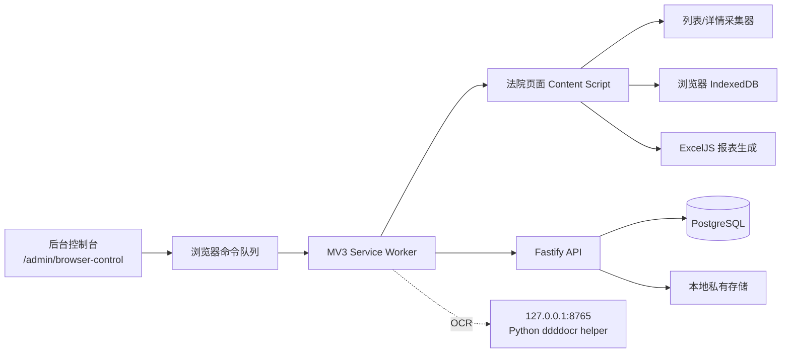

# court-helper

法院立案 / 强制执行查询助手。它是一套面向 Edge（Chromium 也可运行）的 MV3 浏览器扩展系统，用来辅助操作人员在人民法院诉讼服务网完成案件导入、状态查询、截图存证、Excel 报表生成和后台留痕。

> 项目版本：`0.2.0`
>
> GitHub：https://github.com/hyh204511-create/court-helper

## 项目解决什么问题

日常人工流程通常需要反复登录法院平台、按账号寻找案件、抄录状态和案号、保存驳回原因与截图，再把结果填回固定格式的 Excel。court-helper 将其中可重复、可验证的部分串成一条受控流程：

- 导入立案/强执 Excel 模板，校验表头和双表结构；
- 在法院页面采集立案、强执状态及案件证据；
- 对成功、驳回、审核中和未知状态分别处理；
- 自动截图并把截图嵌入导出的 Excel；
- 按账号分组批量执行，3–8 秒随机节流，单批最多 50 条，失败只重试 1 次；
- 将案件、截图、任务和报表记录同步到后台，支持后台再次下载和权限隔离；
- 立案成功、强执成功、已驳回等终态自动向企业微信群机器人推送结果截图与摘要（按系统用户配置 Webhook，正文 @业务员/助理姓名），失败可人工重试。

未知文本不会被猜测映射，而是标记为 `UNKNOWN / 待人工`，避免把不确定结果写成错误业务结论。

## 系统组成



### 主要组件与技术

| 组件 | 技术 | 用途 |
| --- | --- | --- |
| 浏览器扩展 | JavaScript、Chrome/Edge Manifest V3 | Service Worker、Content Script、Options/Setup、网页浮动状态面板 |
| 页面自动化 | `chrome.debugger`、DOM 选择器、Shadow DOM | 注入可信鼠标/键盘事件，读取法院页面并隔离面板样式 |
| 本地数据层 | IndexedDB、`fake-indexeddb` | 案件 upsert、截图 Blob、离线 outbox、批量进度 |
| 后台服务 | TypeScript、Node.js、Fastify 5 | 登录、设备配对、浏览器命令、案件同步、截图/报表接口 |
| 数据库 | PostgreSQL 16/17、`pg`、`pg-mem` | 用户、设备、平台账号、案件、命令、导入批次和报表元数据 |
| Excel | ExcelJS、`openpyxl`（校验脚本） | 模板导入、双表/21 列报表导出、标准 OOXML 图片嵌入 |
| 截图 | `html2canvas`、浏览器 Blob/ArrayBuffer | 成功页和驳回详情页截图、证据上传 |
| OCR | Python、ddddocr、PyInstaller | 仅监听 `127.0.0.1:8765` 的验证码识别辅助服务 |
| 安全 | Argon2id、HttpOnly Cookie、Bearer 设备令牌、CSRF、CORS | 后台认证、扩展配对、凭据边界和请求保护 |
| 通知 | 企业微信群机器人 Webhook、AES-256-GCM | 终态截图与结果自动推送、按系统用户配置与人工重试 |
| 交付 | Docker Compose、PostgreSQL、Nginx TLS、PowerShell、Inno Setup、WinSW | 腾讯云单实例部署和 Windows 本地一体化安装 |
| 测试/构建 | Node test runner、jsdom、esbuild、Python 校验脚本 | 单元测试、模拟平台端到端测试、扩展构建和发布包扫描 |

依赖的精确版本以 [`package-lock.json`](package-lock.json)、[`package.json`](package.json) 和 [`client/ocr-helper/requirements.txt`](client/ocr-helper/requirements.txt) 为准。

## 核心流程

1. 操作人员在后台控制台登录，并完成扩展设备配对。
2. 上传脱敏或真实业务模板；后台创建受控导入批次。
3. 通过统一命令创建登录、立案查询、强执查询或报表导出任务。
4. Service Worker 领取命令，在已打开的法院标签页中驱动 Content Script。
5. 采集器按结构化接口和 DOM 双向校验案件身份，再读取状态、审核记录、案号和日期。
6. 成功或驳回案件截图后写入 IndexedDB，并经 outbox 等待后台确认。
7. ExcelJS 按模板布局生成报表；原始字节同时用于本地下载、SHA-256 和后台上传。

登录自动化是可选能力：默认仍可全人工登录。启用后，凭据从后台受控出口按需取用，只在内存链路中传递；扩展模拟人工填表和真实点击，不直接调用法院登录 API，也不把密码写入扩展存储、Git 或知识库。

## 快速开始（开发）

环境要求：Node.js、Python（OCR/校验脚本需要）、Chromium/Edge；服务端联调还需要 PostgreSQL，或使用仓库提供的 Docker Compose 配置。

```powershell
# 安装依赖
npm.cmd ci

# 运行全部测试
npm.cmd test

# 构建扩展
npm.cmd run build

# 构建服务端 TypeScript
npm.cmd run server:build
```

本地后台与 OCR 的启动、环境变量、数据库迁移和 Windows 安装流程，请参阅：

- [`server/deploy/README.md`](server/deploy/README.md)
- [`docs/delivery/01-普通用户安装与每日使用手册.md`](docs/delivery/01-普通用户安装与每日使用手册.md)
- [`docs/delivery/02-管理员账号设备与权限手册.md`](docs/delivery/02-管理员账号设备与权限手册.md)
- [`docs/delivery/06-Windows本地安装手册.md`](docs/delivery/06-Windows本地安装手册.md)

扩展构建产物由 `scripts/build-extension.mjs` 生成；正式交付应使用 `npm.cmd run release` 或 `npm.cmd run release:windows-local`，不要直接把工作区打包给用户。

## 测试状态

当前仓库测试命令为：

```text
node --test --test-concurrency=2
```

本次基线运行结果：**613 个测试通过，0 个失败**。覆盖范围包括认证与配对、命令队列、登录状态、OCR 边界、法院页面采集、状态识别、批量节流/重试、IndexedDB、截图、Excel 往返、平台账号联系人导入、企业微信 Webhook 通知、服务端迁移、发布包安全检查和模拟平台端到端流程。

自动化测试通过不等于真实平台验收完成；真实验收仍需在已登录的法院会话中走查脱敏案件，并确认当前页面结构和选择器未发生变化。

## 开发中遇到的主要问题与处理方式

### 1. SPA 异步渲染导致登录状态误判

法院站点是异步渲染的，URL 已离开登录页时，用户区可能还没有挂载。直接读取 DOM 会把正常登录误判为会话过期。现在使用有界等待和稳定窗口，只有用户区稳定出现才确认已登录；超时仍转为待人工。

### 2. 合成 click 不被平台接受

平台只响应 `isTrusted=true` 的真实用户事件，普通 `element.click()` 会被静默忽略。登录按钮、验证码刷新和必要的登录方式切换改由 `chrome.debugger` 注入真实鼠标/键盘事件；Debugger 不可用时安全失败，不伪造登录成功。

### 3. 验证码 OCR 识别不稳定

ddddocr 对部分四位验证码会误识别。系统只允许刷新并重试 1 次，仍失败就返回稳定错误码并提示人工处理，禁止无限循环或猜测失败原因。后续若要提升识别率，应单独立项做图像预处理或模型替换。

### 4. 页面文本变化不能靠猜测兼容

法院页面改版、选择器重复、未知状态文本都可能产生错误结果。采集器集中管理选择器，要求唯一、可见和可点击；结构漂移、未知状态或 API/DOM 不一致统一暂停并标记 `UNKNOWN / 待人工`。

### 5. API 数据与 DOM 数据需要互相证明

接口列表和页面卡片可能异步更新，不能只按数组下标或模糊标题绑定案件。现在使用案件名称、参与人、案由、日期等字段做双向唯一匹配；首次不一致时等待 SPA 稳定并只复核一次，仍不一致则不落库、不截图、不导出。

### 6. Excel 图片和日期存在跨工具兼容问题

ExcelJS 的 `oneCellAnchor` 在部分 `openpyxl` 版本中会因 `editAs` 属性解析失败；校验脚本会在读取前兼容处理，但输出文件本身仍是标准 OOXML，Excel/WPS 可正常显示。日期统一使用 UTC 构造，避免本地时区序列化后少一天。

### 7. MV3 Service Worker 会休眠，消息端口会瞬断

命令领取和执行状态不能依赖一次长连接。系统采用短轮询 + `chrome.alarms` 兜底唤醒、单次领取令牌、幂等结果回写，并将案件同步放入 outbox，确保 Worker 重启或网络短暂中断后可以恢复。

### 8. Windows 环境容易误连其他项目数据库

用户级 `DATABASE_URL` 可能指向其他项目。court-helper 的启动包装器会清除外部污染，只连接本项目的 `courthelper` 数据库；服务、PostgreSQL 和 OCR 均绑定回环地址，避免把敏感数据暴露到公网或写入错误库。

### 9. 浏览器调试配置会影响真实联调

较新的 Chrome/Edge 拒绝默认 User Data 目录开启远程调试。联调应使用独立的 `DebugProfile` 或非默认目录，并在该 profile 中重新完成扩展配对；这不是业务代码故障，而是浏览器运行时限制。

## 安全边界

- 真实案号、当事人、身份证号、密码、驳回原因、截图和真实 Excel 不提交 Git，不写入知识库，不放进发布包。
- `accounts.txt` 仅为兼容回退输入，必须保持在 `.gitignore` 中；OCR-only 模式不提供账号文件接口。
- 扩展只申请法院站点、本机 OCR 和受控后台所需权限，不使用 `<all_urls>`。
- 后端不直接调用法院登录 API，也不读取法院 Cookie/Token；操作发生在用户已授权、已登录的浏览器标签页中。
- 凭据查看接口与自动化凭据出口隔离；响应使用 `private, no-store`，命令 payload、日志、扩展 storage 和报表元数据不保存明文密码。
- 发布包会排除 `.env`、证书私钥、浏览器 profile、测试文件、业务 Excel、截图、日志和 `node_modules`。

## 目录说明

```text
extension/       MV3 扩展、Service Worker、Content Script、Options/Setup
server/          Fastify + TypeScript 后台、迁移、Docker/部署配置
client/          Windows OCR helper 打包工程
simulator/       脱敏法院页面模拟器
tests/           扩展、数据层、导出和端到端测试
docs/specs/      各模块规格与验收边界
docs/delivery/   用户、管理员、部署和故障处理手册
scripts/         构建、启动、迁移、校验和发布脚本
installer/       Windows 本地安装器与服务生命周期脚本
```

## 规格与贡献约定

本项目遵循“规格先行、测试驱动、原子提交”：

1. 先阅读对应的 `docs/specs/*.md`，确认范围和范围外内容；
2. 先补失败测试，再实现功能；
3. 运行 `npm.cmd test`、相关构建和必要的安全扫描；
4. 使用 `feat(module): ...`、`fix(module): ...`、`test(module): ...` 等提交格式。

更多长期设计边界见 [`AGENTS.md`](AGENTS.md)、[`docs/交付说明.md`](docs/交付说明.md) 和 [`THIRD_PARTY_NOTICES.md`](THIRD_PARTY_NOTICES.md)。

## 许可证与第三方声明

仓库当前未声明单一开源许可证；依赖及运行时的许可信息见 [`THIRD_PARTY_NOTICES.md`](THIRD_PARTY_NOTICES.md) 与锁定文件。未经授权，不要将真实法院业务数据用于公开演示、测试或第三方服务。
